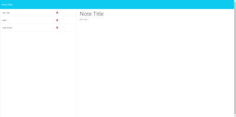

# Note Taker

## Description
This Challenge is to create an application called Note Taker that can be used to write and save notes. 
This application will use an Express.js back end and will save and retrieve note data from a JSON file.

This project includes two pages; page(1) being the landing page of the notes and page(2) being the note taking.
 To get to the second page one should be able to fill out information and hit the note taking button, 
 which will take you to the second page. You will be able to delete and add new notes as needed.


```md

```


## What I learded
The bootcamp students including myself were taught this week how to use post, get, and delete to get an HTTP request to work. We contuined to 
pratice configure an Express.js app to handle GET and POST requests and implemented client-side POST requests to submit form data to a server.
We also tested our API's by (first downloading) using Insomnia and make client-side server requests without having to use a browser.


## Test

Review Note Taker site is working once installed. In terminal type:
npm start. After App will listen to command and will direct you to site once clicking ctlr + click by the following link provided in terminal.
Once the user adds a new note, db.json file will show the following in the terminal; title, text, and id. To end this test, in terminal one may 
click ctrl + c.

## Links
[GitHub](https://github.com/meg-an321/Note-Taker)

[Live URL](https://meg-an321.github.io/Note-Taker/)

